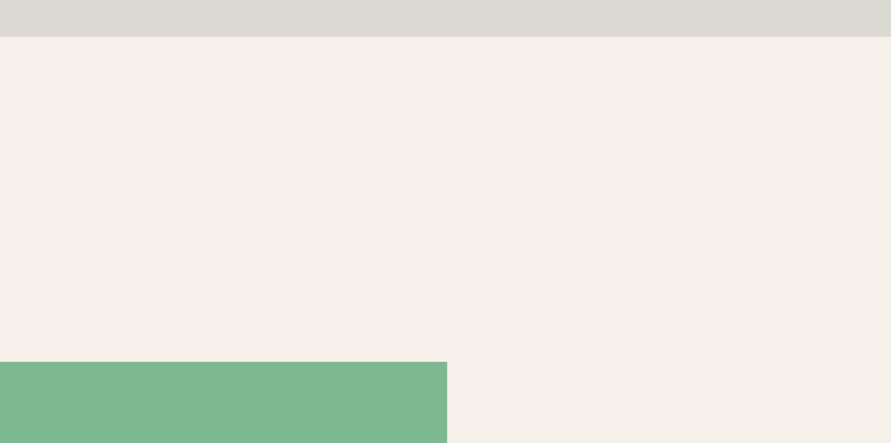

# Typeform-FramerMotion
 New Learning

<h1 align="center">
UI Clone (Motion) - Typeform Homepage ( Old )
</h1>

Typeform Old Homepage motion clone for study purposes.

## Techs

- [x] React
- [x] Framer Motion
- [x] Styled Components
- [x] TypeScript

## Starting Dev Environment

1. cd `/FramerMotion`. 
1. `yarn install`. 
2. `yarn dev`. 

Feito com ♥ by Maykon 
